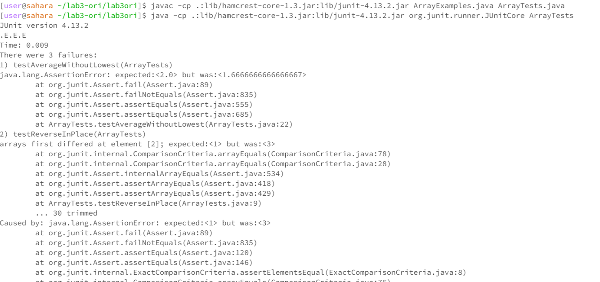
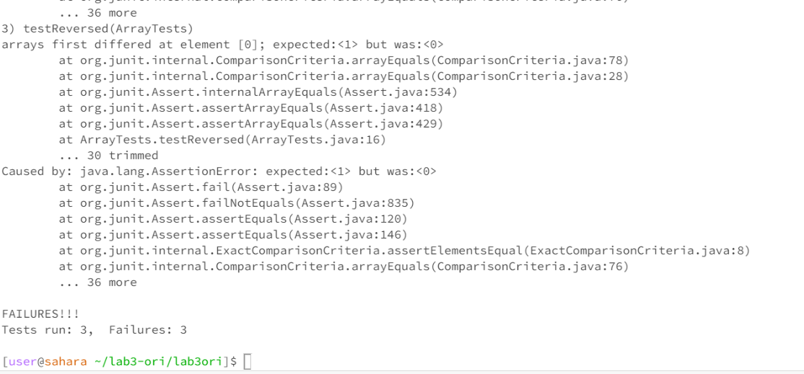
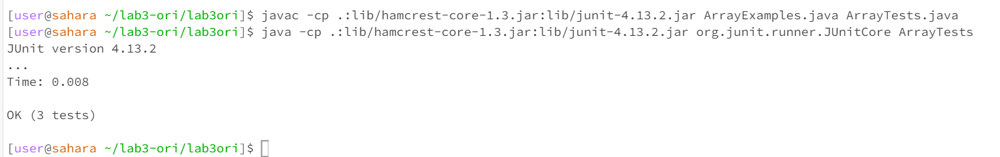

# Lab Report 3 - Bugs and Commands (Week 5)

[live_page_for_GitHub](https://pussakornch.github.io/cse15l-lab-reports3/lab-report.html)

## Part 1 - Bugs

**Array Methods: "Reverse Methods"**


``` bash
// A failure-inducing input
public class ArrayTests {
	@Test 
	public void testReverseInPlace() {
    int[] input1 = { 1, 2, 3 };
    ArrayExamples.reverseInPlace(input1);
    assertArrayEquals(new int[]{ 3, 2, 1 }, input1);
	}


  @Test
  public void testReversed() {
    int[] input1 = { 3, 2, 1 };
    assertArrayEquals(new int[]{ 1, 2, 3 }, ArrayExamples.reversed(input1));
  }

  @Test
  public void testAverageWithoutLowest(){
    double[] input1 = {1.0 ,1.0, 2.0, 3.0};
    assertEquals(2.0, ArrayExamples.averageWithoutLowest(input1), 0.0001);
  }
}
```


``` bash
// An input that doesn’t induce a failure
  @Test 
	public void testReverseInPlace() {
    int[] input1 = { 1, 1, 1 };
    ArrayExamples.reverseInPlace(input1);
    assertArrayEquals(new int[]{ 1, 1, 1 }, input1);
	}

  @Test
  public void testReversed() {
    int[] input1 = { };
    assertArrayEquals(new int[]{ }, ArrayExamples.reversed(input1));
  }

  @Test
  public void testAverageWithoutLowest(){
    double[] input1 = {1.0, 2.0, 3.0, 4.0};
    assertEquals(3.0, ArrayExamples.averageWithoutLowest(input1), 0.0001);
  }
```


**Screenshot from the two inputs**



**These two are the failure inputs** 



**this is success input when the code still has bugs**

``` bash
// Before fixing!
public class ArrayExamples {
  // Changes the input array to be in reversed order
  static void reverseInPlace(int[] arr) {
    for(int i = 0; i < arr.length; i += 1) {
      arr[i] = arr[arr.length - i - 1];
    }
  }

  // Returns a *new* array with all the elements of the input array in reversed
  // order
  static int[] reversed(int[] arr) {
    int[] newArray = new int[arr.length];
    for(int i = 0; i < arr.length; i += 1) {
      arr[i] = newArray[arr.length - i - 1];
    }
    return arr;
  }

  // Averages the numbers in the array (takes the mean), but leaves out the
  // lowest number when calculating. Returns 0 if there are no elements or just
  // 1 element in the array
  static double averageWithoutLowest(double[] arr) {
    if(arr.length < 2) { return 0.0; }
    double lowest = arr[0];
    for(double num: arr) {
      if(num < lowest) { lowest = num; }
    }

    double sum = 0;
    
    for(double num: arr) {
      if(num != lowest) { sum += num; }
    }
    return sum / (arr.length - 1);
  }
}
```


``` bash
// After fixing!
public class ArrayExamples {

  // Changes the input array to be in reversed order
  static void reverseInPlace(int[] arr) {
    int temp;
    for(int i = 0; i < arr.length/2; i += 1) { // input = 1,2,3
      temp = arr[arr.length -i - 1]; // 3        
      arr[arr.length -i - 1] = arr[i];  //     1    // It swich again and make everything the same
      arr[i] = temp;                 // 3    
      //temp = arr[i];

    }
  }

  // Returns a *new* array with all the elements of the input array in reversed
  // order
  static int[] reversed(int[] arr) {
    int[] newArray = new int[arr.length];
    for(int i = 0; i < arr.length; i += 1) { // 123 // 32
      newArray[i] = arr[arr.length - i - 1];
      String.format("The new[i] is %d", newArray[i]);
    }
    return newArray;
  }

  // Averages the numbers in the array (takes the mean), but leaves out the
  // lowest number when calculating. Returns 0 if there are no elements or just
  // 1 element in the array
  static double averageWithoutLowest(double[] arr) {
    int count = 0;
    if(arr.length < 2) 
      { return 0.0; }

    double lowest = arr[0];
    for(double num: arr) { 
      if(num < lowest) { lowest = num; }
    }
    double sum = 0;
    for(double num: arr) {
      if(num == lowest && count == 0)
      {
        count += 1;
      }
      else {
        sum += num;
      }
    }
    return sum / (arr.length - 1);
  }
}
```

**Briefly describe why the fix addresses the issue:** 
1. reverseInPlace: I have created int temp to store the value; then, we can swap the first and last elements without duplicating any value.
2. reversed: I just rearranged the old array into the new array with the back-to-front method.
3. averageWithoutLowest: I only need to make sure that the program will skip the duplicate of the lowest value by adding count so that it will only switch one time.


* The method handleRequest is called
* The argument is URI url. The values are ArrayList<String> s, int num, URI url, String[] parameters, String mess, and String print.
* The values that change are the parameters that get string input from the user, String print that will contain new string make up of the user input without '+' character, ArrayList<String> s that will add the string in print into the array of string (in this case: "Hello"), and the num increase by 1.


## Part 2 "SSH key"


ls command just shows where the private and public key is in this computer
